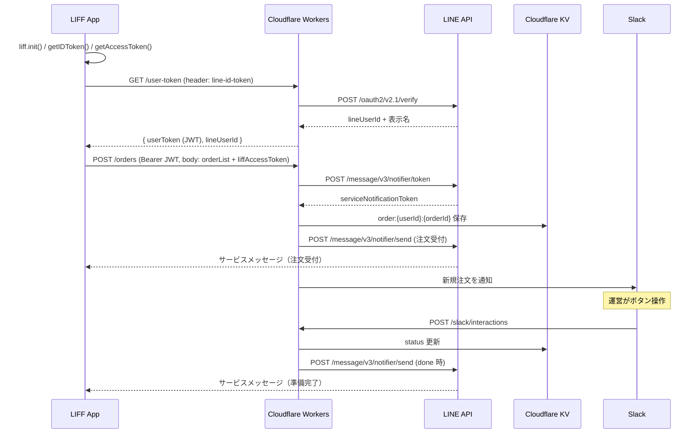

# 機能仕様（バックエンド）

LINEミニアプリ注文システムのバックエンド機能仕様です。技術構成は [tech_structure.md](tech_structure.md)、データ設計は [db_structure.md](db_structure.md)、セキュリティは [security.md](security.md)、用語は [../../operation/dictionary.md](../../operation/dictionary.md) を参照してください。

## データフロー



## 状態遷移

`open → done → closed`

| slug     | 日本語   | 操作（Slack ボタン）   | ユーザーへの LINE 通知 |
| -------- | -------- | ---------------------- | ---------------------- |
| `open`   | 注文受付 | （注文作成時の初期値） | 送る（注文受付）       |
| `done`   | 準備完了 | 準備完了               | 送る                   |
| `closed` | 受渡完了 | 受渡完了               | -                      |

## メニュー

メニューはmicroCMSで管理し、フロントエンドがビルド時に取得して表示します。APIはメニューを保持せず、メニュー取得エンドポイントも持ちません。
注文時はフロントエンドが各明細にメニュー名（`name`）と価格（`price`）を含めて送り、Slack通知・注文履歴の表示に使います。支払いは対面のため、サーバ側で価格の妥当性検証は行いません。

## API 仕様

ベースパスはなく、root直下です。

| メソッド | パス                  | 認証                     | 説明                         |
| -------- | --------------------- | ------------------------ | ---------------------------- |
| GET      | `/`                   | 不要                     | HTML ステータスページ        |
| GET      | `/user-token`         | `line-id-token` ヘッダー | ID Token 検証 → JWT 発行     |
| POST     | `/orders`             | Bearer JWT               | 注文作成                     |
| GET      | `/orders/history`     | Bearer JWT               | ログイン中ユーザーの注文履歴 |
| POST     | `/slack/interactions` | Slack 署名               | Slack ボタン操作の受け口     |

注文状態の更新はSlack経由（`/slack/interactions`）のみで行います。状態更新用のRESTエンドポイントは設けません。

### GET /user-token

`line-id-token` ヘッダーのID TokenをLINEで検証し、JWTを発行します。

- `POST https://api.line.me/oauth2/v2.1/verify` で検証し、`aud` が自チャネルIDと一致するか確認します
- ペイロードから `lineUserId`（sub）と表示名（name）を取得します
- JWT（HS256・1時間・`{ lineUserId, name, iat, exp }`）を署名します
- `{ userToken, lineUserId }` を返します

### POST /orders

リクエスト:

```json
{
  "orderList": [{ "productId": "<microCMS id>", "name": "タコス", "qty": 2, "price": 480 }],
  "liffAccessToken": "..."
}
```

処理:

1. 注文内容を検証します（`productId`・`name` が文字列、`qty` が1以上の整数、`price` が0以上の数値）
2. サービス通知トークンを発行します（`liffAccessToken` を入力）
3. 注文をKVに保存します（`status: open`、表示名はJWTから取得）
4. 注文受付のサービスメッセージをユーザーへ送信します（自動）
5. Slackに新規注文を通知します
6. `{ orderId, status }` を返します

`liffAccessToken` は認証用ではなく、サービス通知トークン発行の入力です。認証は別途Bearer JWTで行います。

### GET /orders/history

ログイン中ユーザーの注文一覧を返します。

```json
{
  "orderList": [
    {
      "orderId": "ord_001",
      "status": "done",
      "orderList": [{ "productId": "<microCMS id>", "name": "タコス", "qty": 2, "price": 480 }],
      "createdAt": "..."
    }
  ]
}
```

### POST /slack/interactions

Slackボタン押下を受けます。`application/x-www-form-urlencoded` の `payload`（JSON）をパースします。

1. 署名を検証します（[Slack 連携](#slack-連携)）
2. `payload.actions[0].value`（`{ userId, orderId, status }`）を検証します
3. 即200を返します（3秒制限）。状態更新・LINE送信・メッセージ差し替えは非同期で実行します
4. 状態を更新し、`done` ならLINEサービスメッセージを送信します
5. `payload.response_url` に `replace_original: true` で投稿し、元メッセージを最新状態へ差し替えます

## サービスメッセージ（LINE MINI App）

注文受付時（注文作成時に自動）と `done`（準備完了、Slack操作）でユーザーへ送ります。状態ごとに別テンプレートを使います。

### サービス通知トークンの発行（注文作成時）

1. クライアントが `liff.getAccessToken()` でLIFFアクセストークンを取得します（有効12時間）
2. 注文作成リクエストのボディに `liffAccessToken` として送ります
3. サーバが発行します: `POST https://api.line.me/message/v3/notifier/token`
   - ヘッダー: `Authorization: Bearer {チャネルアクセストークン}`
   - ボディ: `{ "liffAccessToken": "..." }`
4. 得たトークンを注文の `serviceNotificationToken` に保存します（有効1年・最大5回送信・使用ごとに値が更新）

### 送信（注文受付 / 準備完了）

- エンドポイント: `POST https://api.line.me/message/v3/notifier/send?target=service`
- ヘッダー: `Authorization: Bearer {チャネルアクセストークン}`
- ボディ: `{ "templateName": "...", "params": {...}, "notificationToken": "..." }`
- `templateName` はLINE Developersコンソールで登録したテンプレートの「API用テンプレート名」です（`{template name}_{BCP 47 language tag}`、30文字以内）
- 文面は事前登録テンプレートを使います（自由文は不可です）
- サービス通知トークンは送信のたびに更新されます。送信レスポンスの `notificationToken`（更新後の値）を注文に保存し直し、後続の送信（準備完了）はこの値を使います。1つの注文につき最大5回送信できます

テンプレートと `params` の対応:

| 通知                        | テンプレート（env）                            | `params`                                                                      |
| --------------------------- | ---------------------------------------------- | ----------------------------------------------------------------------------- |
| 注文受付（open・自動）      | `order_request_d_o_ja`（`LINE_TEMPLATE_OPEN`） | `number`=orderId / `order_detail`=明細 / `how_to_receive`=固定文 / `btn1_url` |
| 準備完了（done・Slack操作） | `order_comp_d_o_ja`（`LINE_TEMPLATE_DONE`）    | `number`=orderId / `order_detail`=明細 / `content`=固定文 / `btn1_url`        |

`order_detail` は明細（`name × qty`）を改行区切りで生成します。`btn1_url` はボタンURLで、`FRONTEND_URL` を使います。テンプレートのボタンは省略できない（ボタンなしテンプレートが用意できない）ため、有効なURLを必ず渡します。

## Slack 連携

### 新規注文通知

- `chat.postMessage`（`SLACK_BOT_TOKEN`）で `SLACK_CHANNEL_ID` に投稿します
- 明細に各メニューの価格を表示し、合計金額（`price × qty` の総和）を併記します（対面決済の徴収額確認に使います）
- Block Kitで、現在状態に対する「次の操作」ボタンを1つ表示します（線形フロー）
- ボタンの `value` に `{ userId, orderId, status }` を載せます

### ボタン押下（interaction）

- 受け口は `POST /slack/interactions` です
- 署名検証: `X-Slack-Signature` / `X-Slack-Request-Timestamp`、`v0:{timestamp}:{body}` を `SLACK_SIGNING_SECRET` でHMAC-SHA256、5分のリプレイ許容、定数時間比較
- 3秒以内に200を返し、重い処理は非同期で実行します

## リファレンス

- [サービスメッセージを送信する](https://developers.line.biz/ja/docs/line-mini-app/develop/service-messages/)
- [LINE MINI App API reference](https://developers.line.biz/en/reference/line-mini-app/)
- [Handling user interaction（Slack）](https://docs.slack.dev/interactivity/handling-user-interaction)
- [Verifying requests from Slack](https://docs.slack.dev/authentication/verifying-requests-from-slack)
