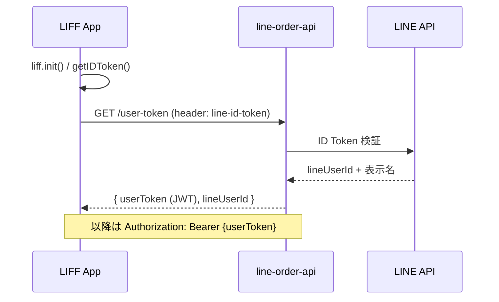

# 機能仕様（ユーザーアプリ / フロントエンド）

LINEミニアプリ注文システムのフロントエンド（LIFFアプリ）の機能仕様です。バックエンドは [../backend/index.md](../backend/index.md)、用語は [../../operation/dictionary.md](../../operation/dictionary.md) を参照してください。

## 概要

- ユーザーがメニューを見て注文し、注文履歴を確認するためのLINE MINI App（LIFF）です。
- 支払いは対面のため、フロントエンドでは決済を扱いません。
- メニューはmicroCMSで管理し、ビルド時に取得して表示します（APIはメニューを保持しません）。
- 注文の進捗（注文受付・準備完了）はLINEのサービスメッセージでユーザーへ届きます。フロントエンドは送信しません。

## 技術構成

- フレームワーク: React（SPA・CSR）+ Vite + TypeScript
- 状態管理 / API通信: Redux Toolkit + RTK Query
- スタイル: CSS Modules
- LINE連携: LIFF（`@line/liff`）。開発時はLIFF Mockを使用
- CMS: microCMS（メニューをビルド時取得）

## 認証フロー

- 起動時にLIFFを初期化し、ID Tokenを取得して `GET /user-token` へ送ります。
- 検証後にアプリ用の `userToken`（JWT・1時間）を受け取り、以降のAPI呼び出しの `Authorization: Bearer` に付与します。
- `userToken` はReduxに保持します。401のときは再ログインを促します。
- 注文時は別途 `liff.getAccessToken()` で取得したLIFFアクセストークンを `POST /orders` のボディに含めます（サービス通知トークン発行に使います。認証用ではありません）。

詳細な認証仕様はbackend側 [../backend/index.md](../backend/index.md) と [../backend/security.md](../backend/security.md) を参照してください。

## 画面構成・ルーティング

現状はスタブで、認証が動く最小構成です。

| パス           | 画面          | 説明                               |
| -------------- | ------------- | ---------------------------------- |
| `/`            | RootRedirect  | LIFF リダイレクト処理後 `/home` へ |
| `/home`        | Home（スタブ） | エントリ                           |
| `/maintenance` | Maintenance   | メンテナンス表示                   |
| `*`            | NotFound      | 404                                |

注文アプリの実画面（メニュー一覧・注文・注文履歴）は順次追加します。想定する導線は「メニュー一覧 → 注文 → 注文履歴」で、バックエンドのフロー（注文受付 → 準備完了 → 受渡完了）に対応します。

## API 連携

| 操作         | API                   | 備考                                       |
| ------------ | --------------------- | ------------------------------------------ |
| トークン発行 | `GET /user-token`     | `line-id-token` ヘッダーで ID Token を送る |
| 注文         | `POST /orders`        | `orderList` と `liffAccessToken` を送る    |
| 注文履歴     | `GET /orders/history` | ログイン中ユーザーの履歴                   |

注文の `orderList` には各明細のメニュー名（`name`）を含めます（microCMSから取得した値）。

## リファレンス

- [LIFF v2 API reference](https://developers.line.biz/ja/reference/liff/)
- [LINE MINI App ドキュメント](https://developers.line.biz/ja/docs/line-mini-app/)
