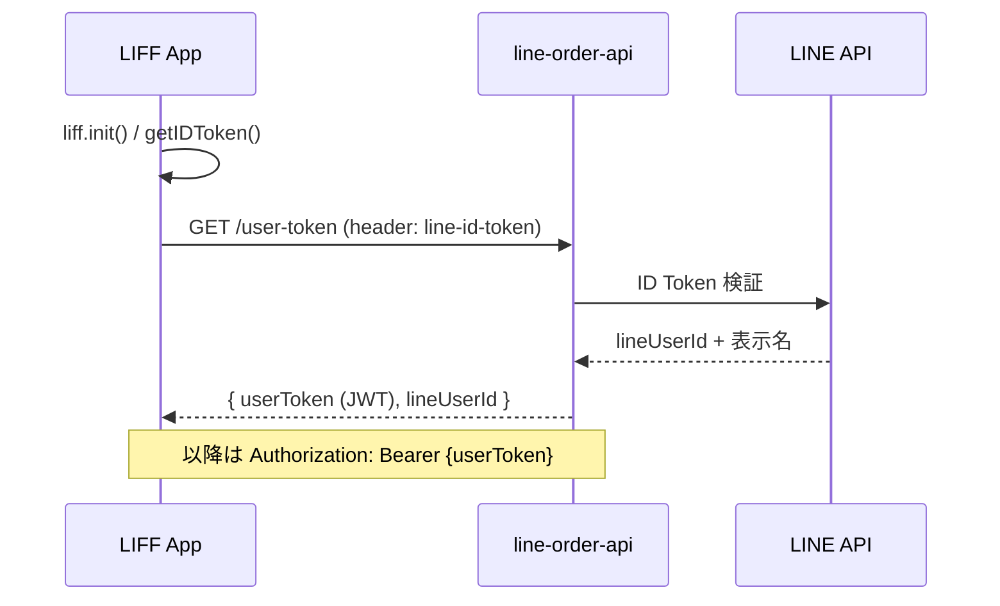

# LINE認証（ユーザーアプリ / フロントエンド）

LIFF（LINEログイン）によるフロントエンド認証の正本仕様です。バックエンドの検証・JWT発行は [../backend/index.md](../backend/index.md) と [../backend/security.md](../backend/security.md)、用語は [../../operation/dictionary.md](../../operation/dictionary.md) を参照してください。

## 認証フロー

- LIFFの初期化は**ページロードごとに毎回**行います。永続化された `userToken` の復元値の有無に影響されません。
- 初期化の前に、期限切れのIDトークンが端末に残っている場合は破棄します（期限切れの残留があるとログイン状態を正しく判定できなくなるため）。
- 初期化後にIDトークンを取得し、`GET /user-token` で検証してアプリ用の `userToken`（JWT）を受け取ります。以降のAPI呼び出しの `Authorization: Bearer` に付与します。
- `/user-token` が401を返した場合は再ログインを促します。

## 起動環境ごとの経路

| 環境                                       | ログイン             | 挙動                                                                                                                      |
| ------------------------------------------ | -------------------- | ------------------------------------------------------------------------------------------------------------------------- |
| LIFFブラウザ（LINEアプリ内・LIFF URL経由） | 自動ログイン         | ログイン画面を表示せずログインが完了します                                                                                |
| 外部ブラウザ                               | リダイレクトログイン | 未ログイン時は初期化がLINEログインへリダイレクトし、完了後にエンドポイントのルートへ `?code=...&state=...` 付きで戻ります |

## コールバック処理の制約

ログインの戻り（`?code=...&state=...`）は、LIFFの初期化がログイン完了に使用します。

- コールバックパラメーター（`code` + `state`、または `liff` で始まるパラメーター）がURLにある間、ルートは画面遷移せず待機します。消化されるとURLからパラメーターが除去されるため、待機は自然に解けます。
- **待機の判定に `userToken` の有無を使ってはなりません。** `userToken` は永続化されるため、復元値が残る再訪時に待機が働かず、コールバックが消化前に失われます。その場合ログインが完了せず再ログインが繰り返され、無限ループになります。
- **ログインの失敗に対して自動で再ログインを試みてはなりません。** 自動ログインに失敗する環境では失敗し続けるためです。再ログインはユーザー操作を起点とします（リファレンス「自動ログインに失敗した時の対応方法」参照）。

## トークンの種類と保持

| トークン             | 取得                    | 有効期限 | 保持                                   | 用途                                                   |
| -------------------- | ----------------------- | -------- | -------------------------------------- | ------------------------------------------------------ |
| IDトークン           | `liff.getIDToken()`     | 1時間    | LIFF SDKが端末に保存                   | `/user-token` での検証入力                             |
| LIFFアクセストークン | `liff.getAccessToken()` | 12時間   | LIFF SDKが端末に保存                   | サービス通知トークン発行の入力（認証用ではありません） |
| userToken（JWT）     | `GET /user-token`       | 1時間    | アプリが永続化し、再訪時に復元されます | APIの `Authorization: Bearer`                          |

## リファレンス

- [LIFF v2 API reference](https://developers.line.biz/ja/reference/liff/)
- [自動ログインに失敗した時の対応方法](https://developers.line.biz/ja/docs/line-login/how-to-handle-auto-login-failure/)
