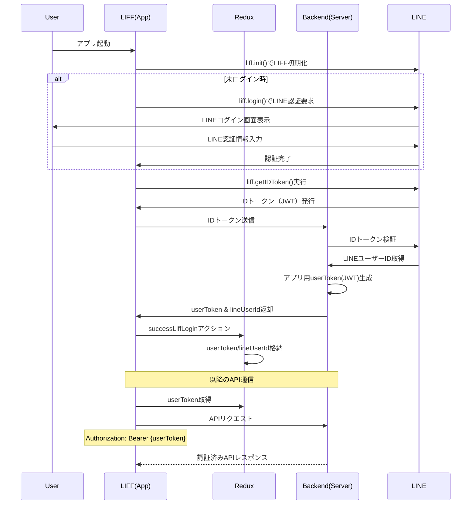

# LINE ログイン認証仕様書

## 概要

LIFFアプリケーションにおけるLINEログイン認証の仕様を定義します。

**注意**: 本仕様書で記載されている実行場所（ファイルパス）、関数名、ディレクトリ構成などは実装例であり、プロジェクトごとに適宜修正してください。

## 認証フロー

### シーケンス図



## 処理詳細（時系列順）

### LIFF 初期化・ログイン判定

- **実行場所**: `src/hooks/useAuthLiff.ts`
- **処理内容**:
  - 環境変数`VITE_APP_ENV`により開発/本番環境を切り替え
  - 開発環境ではLIFF Mock、本番環境では実際のLIFF認証を実行
  - 本番環境ではLINEアプリ内ブラウザまたは外部ブラウザでの動作を判定
  - 未ログインの場合は`liff.login()`を実行してLINE認証を開始

```typescript
// LIFF初期化・ログイン例（抜粋）
const isLocalEnv = import.meta.env.VITE_APP_ENV === 'local'

// LIFF APIプラグインを事前登録
liff.use(new IsInClientModule())
liff.use(new GetIdToken())
// @ts-expect-error - LiffMockPluginの型定義の問題を回避
liff.use(new LiffMockPlugin())

// local開発環境ではmockを使用してLINE認証をスキップ
await liff.init({ liffId, withLoginOnExternalBrowser: true, mock: isLocalEnv })
```

### LINE ID トークン取得

- **実行場所**: `src/hooks/useAuthLiff.ts`
- **処理内容**:
  - 認証成功後、`liff.getIDToken()`でLINE IDトークン（JWT形式）を取得
  - このIDトークンをバックエンドサーバー（AWS）へ送信

### ユーザー情報取得・トークン発行

- **実行場所**: バックエンドAPI（AWS）
- **処理内容**:
  - 受信したLINE IDトークンを検証
  - トークンからLINEユーザーIDを抽出
  - アプリケーション用のJWT（userToken）を生成
  - userTokenとlineUserIdをフロントエンドへ返却

### Redux へユーザー情報格納

- **実行場所**: `src/store/liffUser.ts`
- **管理する状態**:
  - `userToken`: ユーザー識別用トークン（API認証で使用）
  - `lineUserId`: LINEのユーザーID

```typescript
// src/store/liffUser.ts（抜粋）
type State = {
	userToken: string | undefined | null;
	lineUserId: string | undefined | null;
};

export const liffUser = createSlice({
	name: "liffUser",
	initialState,
	reducers: {
		successLiffLogin: (
			state,
			action: PayloadAction<{ userToken: string; lineUserId: string }>
		) => {
			state.userToken = action.payload.userToken;
			state.lineUserId = action.payload.lineUserId;
		},
		failureLiffLogin: (state) => {
			state.userToken = null;
			state.lineUserId = null;
		},
	},
});
```

### 認証後のAPIアクセス

- **実行場所**: 各APIリクエスト処理
- **処理内容**:
  - Redux stateから`userToken`を取得
  - すべてのAPIリクエストのHeaderに`Authorization: Bearer {userToken}`を付与
  - バックエンドはこのトークンを検証してAPIアクセスを許可

### セッション管理・有効期限処理

#### セッション管理の基本仕様

- **userToken有効期限**: 1時間（LINE IDトークンと同一）
- **セッション切れ判定**: HTTP 401エラーまたはトークン期限切れ
- **管理場所**: Redux store（`layout.tokenError`フラグ）

#### セッション管理の実装

- **実行場所**: `src/hooks/useAuthLiff.ts` および `src/layout/AppWrapper/useAppWrapper.ts`
- **セッション切れ検知**: APIレスポンスでの401エラーを手動で処理
- **動作**: HTTP 401/500エラー時に適切なエラーダイアログを表示

```typescript
// セッションエラー処理（useAuthLiff.ts抜粋）
if (!fetchRes.ok) {
  if (fetchRes.status === 500) {
    dispatch(setGlobalError(true))
    dispatch(setErrorMessage('サーバーエラーが発生しました。'))
  }
  if (fetchRes.status === 401) {
    dispatch(setTokenError(true))
    dispatch(setErrorMessage('再ログインが必要です。'))
  }
}
```

#### アプリケーション起動時の自動LIFF初期化

- **実行場所**: `src/layout/AppWrapper/useAppWrapper.ts`
- **実装内容**: アプリ起動時に自動的にLIFF認証を開始
- **制御**: 初期化は一度だけ実行され、すでにuserTokenがある場合はスキップ

```typescript
// 自動LIFF初期化（useAppWrapper.ts抜粋）
useEffect(() => {
  if (!initRef.current && !isInitialized && !userToken) {
    initRef.current = true
    actLoginLiff()
    setIsInitialized(true)
  }
}, [isInitialized, userToken])
```

#### 処理フロー

1. アプリ起動時に`useAppWrapper`で自動的にLIFF初期化を実行
2. `useAuthLiff`でLINE認証またはモック認証を実行
3. 認証成功時は`successLiffLogin`でuserTokenとlineUserIdをReduxに保存
4. API通信時にuserTokenをAuthorizationヘッダーに設定
5. 401エラー発生時は`setTokenError`でエラーダイアログを表示
6. ユーザーが再ログイン完了で新しい認証フローが開始

## 環境管理

### 環境変数

| 変数名                | 説明                           | 管理場所               |
| --------------------- | ------------------------------ | ---------------------- |
| `VITE_LIFF_ID`        | LIFF ID                        | フロントエンド環境変数 |
| `VITE_APP_ENV`        | 実行環境（local/staging/prod） | フロントエンド環境変数 |
| `VITE_API_BASE_URL`   | APIベースURL                   | フロントエンド環境変数 |
| `LINE_CHANNEL_ID`     | LINEチャネルID                 | バックエンド環境変数   |
| `LINE_CHANNEL_SECRET` | LINE チャネルシークレット      | バックエンド環境変数   |

### 開発環境サポート

#### LIFF Mock プラグイン

- **目的**: 開発環境でLINEプラットフォーム上での認証フェーズをスキップし、効率的な開発・テストを実現
- **切り替え方法**: `useAuthLiff`で`VITE_APP_ENV`の値により自動切り替え
- **動作詳細**:
  - `VITE_APP_ENV='local'`の時は`liff.mock`を有効化
  - LINEプラットフォームへの実際の認証要求をスキップ
  - モックされたIDトークンとユーザー情報を返却
- **利点**: LINE実環境に接続せずローカルでの動作検証、安定した単体テスト、CI/CD自動テストが可能

#### 型定義の対処

- **ファイル**: `src/types/liff.d.ts`
- **目的**: `@line/liff-mock`の型エラーを解決するための型定義拡張
- **内容**: LIFFコアモジュールにモック用のインターフェイスを追加

```typescript
import { Liff as LiffCore } from '@line/liff'
import { ExtendedInit, LiffMockApi } from '@line/liff-mock'

declare module '@line/liff/core' {
  export interface Liff extends LiffCore {
    init: ExtendedInit
    $mock: LiffMockApi
  }
}
```

## トークン管理

### LINE ID トークン

- **有効期限**: 1時間
- **用途**: バックエンドへのユーザー認証情報送信
- **形式**: JWT

### userToken（アプリケーショントークン）

- **生成元**: バックエンドサーバー
- **用途**: API認証
- **保存場所**: Redux store（`src/store/liffUser.ts`）
- **形式**: JWT
- **有効期限**: 1時間（LINE IDトークンと同じ期限に設定）

```typescript
// バックエンドでのuserToken生成例
// アプリケーション独自のJWTでLINEユーザIDをラップして
// 以降のアクセスでのユーザー識別に使用
const userToken = jwt.sign({ lineUserId }, jwtSecret, { expiresIn: "1h" });
```

## セキュリティ要件

### 必須実装事項

1. **トークン検証の実施場所**

   - フロントエンドから受け取ったIDトークンは必ずバックエンドで検証
   - バックエンドでLINE APIを使用してIDトークンの有効性を確認
   - 検証後にユーザーIDを取得してフロントエンドに返却

2. **API通信のセキュリティ**

   - すべてのAPIエンドポイントでuserToken（JWT）を要求
   - HeaderのAuthorization BearerスキームでuserTokenを送信
   - HTTPSでの通信を強制

3. **機密情報の管理**

   - Channel ID、Channel Secretはバックエンドで管理
   - フロントエンドにはChannel Secretを送信しない

4. **セッションセキュリティ**
   - セッション管理は「7. セッション管理・有効期限処理」を参照

## エラーハンドリング

| エラー種別          | 処理方法                         | Redux 状態変更                                 |
| ------------------- | -------------------------------- | ---------------------------------------------- |
| ID トークン期限切れ | `setTokenError`アクション実行    | `layout.tokenError: true`                      |
| トークン検証失敗    | `failureLiffLogin`アクション実行 | `userToken: null`, `lineUserId: null`          |
| ネットワークエラー  | リトライ処理実施                 | 状態変更なし                                   |
| セッション切れ検知  | 再ログイン UI 表示               | `layout.tokenError: true`                      |
| 再ログイン成功      | `successLiffLogin`アクション実行 | 新しいトークン格納, `layout.tokenError: false` |

### セッション切れ後の UI 制御

- `layout.tokenError: true`の場合、アプリで以下の制御を実行:
  - 「再ログインが必要です」等のメッセージ表示
  - エラーダイアログの表示
  - ユーザーによる再ログイン操作の誘導

## LIFFアプリ構築前のID Token取得方法

### 概要

LIFFアプリケーション開発前の検証段階で、LINEログインのID Tokenを手動で取得する方法です。バックエンド側での検証やテスト時に活用できます。

### 認可コードの取得

#### 取得フロー

1. 認証URLをブラウザで開く
2. LINEログイン画面でユーザー認証
3. 権限許可画面で承認（初回のみ）
4. コールバックURLへリダイレクト
5. URLパラメーターから認可コードを取得

#### 認証URL構成

```
https://access.line.me/oauth2/v2.1/authorize?
response_type=code&
client_id=【チャネルID】&
redirect_uri=【リダイレクトURL】&
state=【ランダムな文字列】&
scope=openid%20profile
```

#### パラメーター設定値

| パラメーター   | 例                    | 取得元                           | 備考                   |
| -------------- | --------------------- | -------------------------------- | ---------------------- |
| `client_id`    | `0987654321`          | LINEログインチャネルのチャネルID | チャネル基本設定で確認 |
| `redirect_uri` | `https://example.com` | コールバックURL                  | HTTPSの検証用URL       |
| `state`        | `1234567890`          | 任意のランダム文字列             | CSRF対策用             |
| `scope`        | `openid%20profile`    | 取得情報の範囲                   | プロファイル情報取得   |

**⚠️ 注意事項**:

- 認可コードの有効期間は10分
- 認可コードは1回のみ利用可能
- `redirect_uri`はLINE DevelopersコンソールのLINEログイン設定で事前に登録したコールバックURLと完全に一致する必要があります

### ID Tokenの取得

#### API呼び出し

認可コードを使用してLINE APIからID Tokenを取得します。

```bash
curl -v -X POST https://api.line.me/oauth2/v2.1/token \
-H 'Content-Type: application/x-www-form-urlencoded' \
-d 'grant_type=authorization_code' \
-d 'code=【認可コード】' \
--data-urlencode 'redirect_uri=【リダイレクトURL】' \
-d 'client_id=【チャネルID】' \
-d 'client_secret=【チャネルシークレット】'
```

#### レスポンス例

```json
{
	"access_token": "bNl4YEFPI/hjFWhTqexp4MuEw5YPs...",
	"expires_in": 2592000,
	"id_token": "eyJhbGciOiJIUzI1NiJ9...",
	"refresh_token": "Aa1FdeggRhTnPNNpxr8p",
	"scope": "profile",
	"token_type": "Bearer"
}
```

### 事前準備

#### LINE Developersコンソール設定

1. **LINE Developersコンソール**にログイン
2. 対象のLINEログインチャネルを選択
3. **「LINEログイン設定」**タブを開く
4. **「コールバックURL」**に検証用のHTTPS URLを追加
   - 例: `https://tam-tam.co.jp`
   - 実際にアクセス可能である必要はありません
5. 設定を保存

#### 必要な情報の確認

- **チャネルID**:「チャネル基本設定」タブで確認
- **チャネルシークレット**:「チャネル基本設定」タブで確認
- **コールバックURL**: 上記で設定したURL

### 活用場面

- バックエンドAPIの動作検証
- トークン検証機能のテスト
- 開発環境でのユーザー認証テスト
- LIFFアプリ開発前の事前検証

## 参考資料

- [アプリとサーバーの間で安全なログインプロセスを構築する](https://developers.line.biz/ja/docs/line-login/secure-login-process/)
- [LINE Login API リファレンス](https://developers.line.biz/ja/reference/line-login/#issue-access-token)
