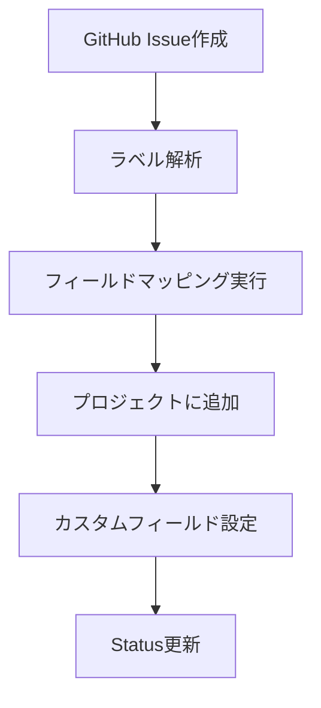

# Issue作成時のGitHub Projects連携ルール

## 概要
Issue作成時にGitHub Projectsへ自動的に追加・連携するためのルール・手順を定義します。
このルールは主に`sync_with_github`でのIssue作成時と`manage_github_projects`での手動追加時に適用されます。
プロジェクト固有の設定については、[プロジェクト要件定義](../../_llm-docs/project.md)から参照してください。

## 1. フィールド体系

### 標準フィールド定義

| フィールド名   | タイプ | 汎用的な値                                           | 説明             |
| -------------- | ------ | ---------------------------------------------------- | ---------------- |
| **Status**     | Select | `No status`, `Todo`, `In Progress`, `Done`           | Issue進捗状況    |
| **Priority**   | Select | `Critical`, `High`, `Medium`, `Low`                  | 優先度           |
| **IssueType**  | Select | `Feature`, `Bug`, `Documentation`, `Enhancement`     | Issue種別        |
| **Category**   | Select | `structure`, `frontend`, `backend`, `infrastructure` | 技術領域         |
| **Section**    | Select | プロジェクト固有                                     | 対象サイト・機能 |
| **Repository** | Text   | -                                                    | 所属リポジトリ   |
| **Labels**     | Text   | -                                                    | GitHubラベル     |

### フィールド値の定義

#### Priority（優先度）
- `Critical`: システム停止、重大なセキュリティ問題
- `High`: 主要機能の不具合、重要な新機能
- `Medium`: 通常の開発サイクルで対応
- `Low`: 時間があるときに対応

#### IssueType（Issue種別）
- `Feature`: 新機能実装
- `Bug`: バグ修正
- `Documentation`: ドキュメント作成・更新
- `Enhancement`: 既存機能改善

#### Category（技術領域）
- `structure`: 構造・アーキテクチャ関連
- `frontend`: フロントエンド関連
- `backend`: バックエンド関連
- `infrastructure`: インフラ関連

## 2. フィールドマッピング仕様

### ラベル→フィールド変換規則

#### Issue種別マッピング
```json
{
  "label_to_issue_type": {
    "enhancement": "Feature",
    "bug": "Bug",
    "documentation": "Documentation",
    "refactor": "Enhancement",
    "api": "Feature",
    "ui": "Feature",
    "database": "Feature",
    "test": "Enhancement"
  }
}
```

#### 優先度マッピング
```json
{
  "label_to_priority": {
    "critical": "Critical",
    "high": "High", 
    "medium": "Medium",
    "low": "Low",
    "bug": "High",
    "enhancement": "Medium",
    "documentation": "Low"
  }
}
```

#### 技術領域マッピング
```json
{
  "label_to_category": {
    "frontend": "frontend",
    "backend": "backend", 
    "infrastructure": "infrastructure",
    "ui": "frontend",
    "api": "backend",
    "database": "backend",
    "ci/cd": "infrastructure"
  }
}
```

### デフォルト値設定

| フィールド | デフォルト値 | 設定条件               |
| ---------- | ------------ | ---------------------- |
| Status     | `Todo`       | 新規Issue作成時        |
| Priority   | `Medium`     | ラベルからの判定不可時 |
| IssueType  | `Feature`    | ラベルからの判定不可時 |
| Category   | `structure`  | 技術領域の判定不可時   |

## 3. 自動化仕様

### Issue追加の自動化

#### 自動追加トリガー
1. **新規Issue作成時**: GitHub Webhook または定期同期
2. **ラベル更新時**: フィールド値の再計算・更新
3. **Issue状態変更時**: Status フィールドの同期

#### 自動化フロー


#### 処理ルール
```typescript
interface AutomationRule {
  trigger: 'issue_created' | 'issue_updated' | 'labels_changed';
  condition: {
    repository?: string[];
    labels?: string[];
    state?: 'open' | 'closed';
  };
  action: {
    add_to_project: boolean;
    update_fields: Record<string, string>;
    set_status: string;
  };
}
```

### ステータス同期

#### GitHub Issue状態 → Projects Status
```json
{
  "state_mapping": {
    "open": "Todo",
    "in_progress": "In Progress", 
    "closed": "Done"
  }
}
```

#### 同期タイミング
- Issue状態変更時（リアルタイム）
- 定期同期実行時（1日1回）
- 手動同期実行時

### カテゴリ分類

#### 自動分類ルール
1. **ラベルベース分類**: ラベルから技術領域を判定
2. **リポジトリベース分類**: リポジトリから対象サイトを判定  
3. **タイトル解析**: 自然言語処理による分類補完

#### 分類精度向上
- 機械学習モデルによる分類精度の向上
- ユーザーフィードバックによるルール改善
- 分類結果の統計分析・最適化

## 4. 権限・アクセス管理

### 必要権限一覧

#### GitHub組織レベル
- **Projects (write)**: プロジェクト操作権限
- **Issues (write)**: Issue作成・更新権限
- **Repository (write)**: 対象リポジトリアクセス権限

#### 個人アクセストークン設定
```bash
# 必要スコープ
- repo (フルアクセス)
- project (プロジェクトアクセス) 
- read:org (組織情報読み取り)
```

#### GitHub CLI認証
```bash
# 認証確認
gh auth status

# 権限確認
gh api user

# プロジェクトアクセス確認  
gh project list --owner [ORGANIZATION]
```

### アクセス制御

#### ユーザー権限レベル
| レベル    | 権限     | 実行可能操作                                |
| --------- | -------- | ------------------------------------------- |
| **Admin** | 全権限   | プロジェクト設定、フィールド管理、Issue管理 |
| **Write** | 書き込み | Issue追加・更新、フィールド更新             |
| **Read**  | 読み取り | プロジェクト閲覧、Issue閲覧                 |

#### 操作ログ
- プロジェクト変更の監査ログ
- API使用状況の記録
- エラー発生時の詳細ログ

### セキュリティ対策

#### API制限
- レート制限の監視・制御
- 認証トークンの定期ローテーション
- アクセス失敗時のアラート

#### データ保護
- 機密情報の Projects フィールドへの記載禁止
- アクセスログの暗号化
- バックアップデータの保護

## 5. 設定手順

### 初期設定

#### 1. プロジェクト作成
```bash
# GitHub CLI を使用したプロジェクト作成
gh project create --owner [ORGANIZATION] --title "[PROJECT_NAME]"
```

#### 2. カスタムフィールド設定
```bash
# Priority フィールド追加
gh project field-create --project-id PROJECT_ID --name Priority --type select --options "Critical,High,Medium,Low"

# IssueType フィールド追加  
gh project field-create --project-id PROJECT_ID --name IssueType --type select --options "Feature,Bug,Documentation,Enhancement"

# Category フィールド追加
gh project field-create --project-id PROJECT_ID --name Category --type select --options "structure,frontend,backend,infrastructure"

# Section フィールド追加（プロジェクト固有の値を設定）
gh project field-create --project-id PROJECT_ID --name Section --type select --options "[PROJECT_SPECIFIC_VALUES]"
```

#### 3. 自動化設定
```bash
# Webhook設定（GitHub側）
gh repo edit --add-webhook --url "WEBHOOK_URL" --events issues,pull_request
```

### MCPサーバー設定

#### config-loader.ts 設定テンプレート
```typescript
export const GITHUB_PROJECTS_CONFIG = {
  organization: "[ORGANIZATION]",
  project_id: "[PROJECT_ID]", 
  fields: {
    priority: "Priority",
    issue_type: "IssueType", 
    category: "Category",
    section: "Section"
  },
  field_mappings: {
    // ... マッピング定義
  }
};
```

#### 環境変数設定
```bash
export GITHUB_TOKEN="ghp_xxxxxxxxxxxx"
export GITHUB_ORG="[ORGANIZATION]"
export GITHUB_PROJECT_ID="[PROJECT_ID]"
```

### 動作確認

#### 1. アクセス確認
```bash
# MCPツール経由
manage_github_projects action="check_access"

# 直接確認
gh project list --owner [ORGANIZATION]
```

#### 2. Issue追加テスト
```bash
# テストIssue作成
gh issue create --repo [ORGANIZATION]/[REPOSITORY] --title "テストIssue" --label "enhancement"

# プロジェクトへの追加確認
manage_github_projects action="add_issue" issue_url="ISSUE_URL" repo="[REPO]"
```

## 6. 運用・メンテナンス

### 定期メンテナンス

#### 週次作業
- [ ] プロジェクトの同期状態確認
- [ ] 未分類Issueの分類
- [ ] フィールド設定の最適化

#### 月次作業  
- [ ] 自動化ルールの効果測定
- [ ] フィールドマッピングの精度確認
- [ ] 権限設定の見直し

### トラブルシューティング

#### よくある問題

**1. Issue がプロジェクトに追加されない**
```bash
# 権限確認
gh auth status
manage_github_projects action="check_access"

# 手動追加テスト
manage_github_projects action="add_issue" issue_url="ISSUE_URL" repo="REPO"
```

**2. フィールドが正しく設定されない**
- ラベルマッピングの確認
- フィールド名の一致確認
- プロジェクトID の確認

**3. 認証エラー**
```bash
# トークン再作成
gh auth refresh

# 権限スコープ確認
gh auth status --show-token
```

### パフォーマンス最適化

#### API使用量最適化
- バッチ処理による API 呼び出し削減
- キャッシュ機能の活用
- レート制限の効率的な利用

#### 処理速度向上
- 並列処理の導入
- 不要な API 呼び出しの削除
- データ変換処理の最適化

## 関連ドキュメント

- **プロジェクト固有設定**: [プロジェクト要件定義](../../_llm-docs/project.md)から参照
- **Issue形式仕様**: [Issue形式仕様](./format.md)
- **MCPサーバー**: [MCPサーバー技術仕様](../../_llm-docs/operation/mcp/tech_structure.md)

---

**⚠️ 重要**: このドキュメントはIssue作成時のProjects連携に特化したルールを定義します。プロジェクト固有の設定は[プロジェクト要件定義](../../_llm-docs/project.md)から参照してください。